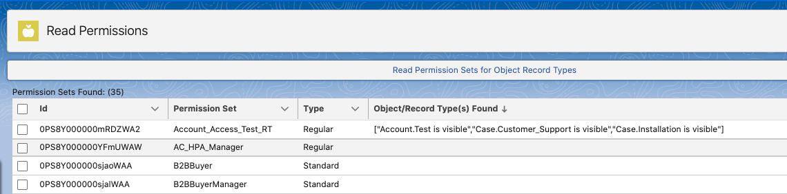
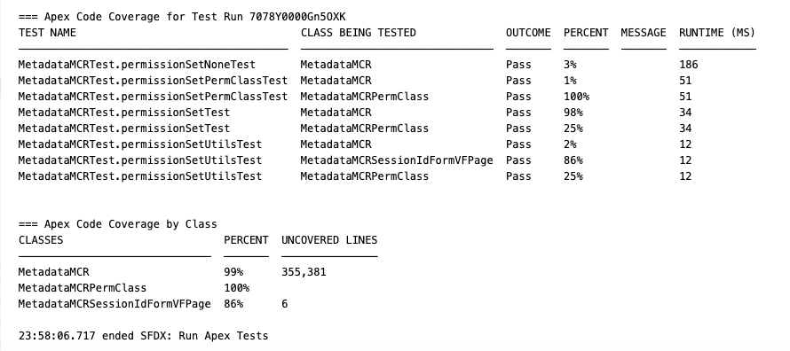

 
# Read Assigned Record Types for Objects in Specific Permission Sets
This repository was born out of a need to read Permission Sets (PS) Record Type Assignments for various Objects. At this point (6/2024), SOQL can't do this 100% from what I can find. I found various examples of code that can do this and have links to them below.

You can use the Metadata service to read thru the PS and find which Objects have Assigned Record Types. Having to look at each PS was tedious. Using this LWC (with Apex) you can select up to 10 PS (Salesforce Limitation) and find all the Objects and the Record Types that have been set.

A Lightning Datable will display PS and which Objects and Assigned Record Types there are. No data is changed, you would still need to go to the PS and uncheck Assigned Record Type if you want to remove them. The code just builds a string of Object/Record Types found and displays them.

A Test class is included also. 

The MetadataMCR class only has parts and pieces to accomodate the Permission Set. The full version of that class is well over 13k lines of code. I basically took what was needed for PS and butchered it up and renamed some of the files used with *MCR.

Once it is deployed, you can add the LWC to any page.

By the way, I'm sure I copied everything right, and you may also...

## Some things...

Links for features used
- [Get Session Id](https://salesforce.stackexchange.com/questions/411712/not-able-to-call-metadata-api-service-from-lwc-controller-using-apex-class)

Read Permission Set Metadata 
- [Read Permission Set Metadata](https://salesforce.stackexchange.com/questions/362049/pull-record-types-per-permission-set-through-metadata-api)

Deploy to Salesforce Button 
- [Deploy to Sales Button](https://andyinthecloud.com/2014/09/27/the-new-github-deploy-to-salesforce-tool-button/)

Github Repository for apex-mdapi
- [apex-mdapi](https://github.com/certinia/apex-mdapi)

Create your Own Salesforce Developer Org
- If you want to play around with this, just create a Dev Org (link below) and use the Deploy button above to install it there. You would need to setup Record Types for some object(s) and check them off in the Permission Set(s) you want to work with.
- [Create your Own Salesforce Developer Org](https://developer.salesforce.com/signup)

## As I have time I will add more comments on what all is going on. Some of the LWC and Apex have comments along the way. It's a complicated mess of stuff. Some of the Metadata can be hard to wrap your head around.

## Enjoy and send comments!
- [Repo Link](https://github.com/mcrdjr/ReadPermSetObjectRecordTypes)

## [Gal 2:20](https://kjvgalatians220.com/)

